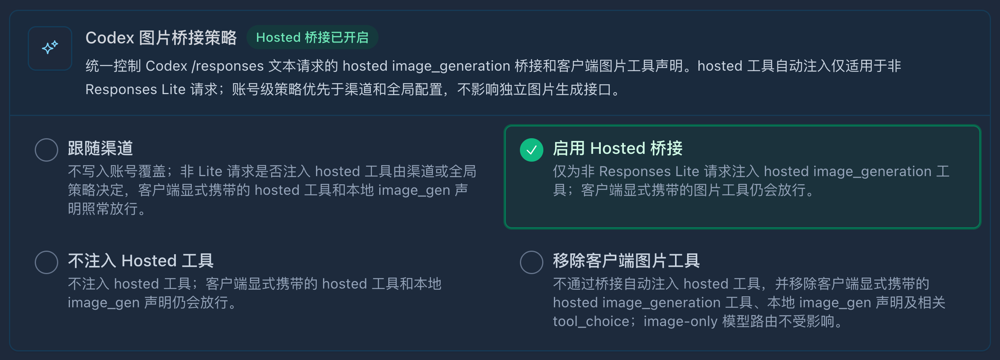

# codex-sub2api-image-gen


一个给 Codex 使用的图片生成 Skill：当内置 `$imagegen` 不可用、缺失或被自定义 provider / sub2api 拦截时，改用当前 Codex provider 直接调用兼容的 Images API。


## 特点

- 自动读取当前 Codex provider 的 `base_url`、`experimental_bearer_token` 和自定义请求头。
- 使用非 OpenAI SDK 的 User-Agent，绕开已知的 sub2api / Cloudflare SDK 请求头拦截。
- 支持图片生成、图片编辑、无费用连通性检查和脱敏 dry run。
- 仅依赖 Python 标准库，不安装 OpenAI SDK。
- 默认使用 `gpt-image-2.5-sunburst`，尺寸为 `auto`；可用 `--model gpt-image-2` 保留旧模型和 `3840x2160` 默认尺寸；服务端返回多大就原样保存多大，不在本地超分、缩放、补边或重采样。

## 环境要求

- Codex
- Python 3.11+，或 uv（自动准备兼容的 Python）
- 已配置且支持 Images API 的 Codex custom provider / sub2api

## 安装

把整个仓库直接克隆到 Skill 目录：

```bash
mkdir -p ~/.agents/skills
git clone https://github.com/huysh3/sub2api-gpt-image-2.git ~/.agents/skills/sub2api-imagegen
```

仓库根目录就是 Skill 根目录，不需要绑定或创建专属 Agent。重启 Codex 或开启一个新任务即可使用。

## 使用

直接在 Codex 中调用：

```text
$sub2api-imagegen 帮我生成一张雨夜霓虹街道的横版图片
```

编辑已有图片也是一句话：

```text
$sub2api-imagegen 把 input.png 的背景换成日落，主体保持不变
```

Codex 当前显式调用 Skill 使用 `$skill-name`；不需要手动执行底层 Python 命令。只有排查 provider 连通性时才需要：

```bash
python3 ~/.agents/skills/sub2api-imagegen/scripts/sub2api_image_gen.py doctor
```

没有 Python 3.11+ 时，可直接使用 uv；脚本已声明 Python 版本，uv 会自动准备解释器（首次可能需要下载），无需安装 SDK：

```bash
uv run ~/.agents/skills/sub2api-imagegen/scripts/sub2api_image_gen.py doctor
uv run ~/.agents/skills/sub2api-imagegen/scripts/sub2api_image_gen.py generate --model gpt-image-2.5-flare --prompt "雨夜霓虹街道" --out output/imagegen/street.png
```

`generate`、`edit`、`doctor` 均通过 `--model` 选择完整模型名，无需额外分型参数：

| 模型 | 适用场景 |
| --- | --- |
| `gpt-image-2.5-sunburst`（本客户端默认） | 精细编辑、强调保留参考图细节 |
| `gpt-image-2.5-flare` | 快速、日常高质量生图；也支持编辑 |

两者都支持 `-2026-09-08` 快照名。`gpt-image-2.5` 不是官方文档列出的模型 ID；显式传入时仅作为代理自定义别名透传并警告，不自动映射或回退。模型列表和出图成功均不能证明代理实际使用的上游分型。

`--quality` 支持 `low/medium/high/xhigh/max/auto`，其中 `xhigh/max` 是 2.5 新增档位；客户端保留 `medium` 默认值，官方默认是 `auto`。两型号 token 单价相同，但耗用 token 可不同，不代表每张图同价。

2.5 默认尺寸为 `auto`；显式尺寸须为 16 的倍数，最长边 ≤3840，宽高比在 1:3～3:1，总像素 655,360～8,294,400；高于 2560×1440 属实验范围。透明背景使用 PNG 或 WebP。

来源：[官方生图指南](https://developers.openai.com/api/docs/guides/image-generation)、[Sunburst](https://developers.openai.com/api/docs/models/gpt-image-2.5-sunburst)、[Flare](https://developers.openai.com/api/docs/models/gpt-image-2.5-flare)（2026-09-27 核对）。当前 Hero 仅通过文字提示词生成，未传入参考图；请求使用 `model=gpt-image-2.5-sunburst`、`quality=high`，服务端返回 1672×941，原样保存。

## 路由与凭证

- 配置路径：`--config PATH` > `$CODEX_HOME/config.toml` > `~/.codex/config.toml`。
- endpoint：`OPENAI_BASE_URL` > 所选 provider 的 `base_url`；必须显式配置，不自动切换到 OpenAI 官方地址。
- API key：`OPENAI_API_KEY` 环境变量 > provider 的 `experimental_bearer_token` > 配置文件同目录 `auth.json` 的顶层 `OPENAI_API_KEY`。
- 仅当前两项缺失时读取 `auth.json`；不读取 OAuth `tokens`。该 API key 会用于上述 endpoint，请确保二者匹配。使用 `--config` 时不会再读取默认目录的认证文件。
- 仅有 `auth.json` 时，可设置 `OPENAI_BASE_URL`，无需创建 `config.toml`。dry run 会标明是否使用了认证文件，但不输出 key。

当前已在 Codex 图片策略选择「启用 Hosted 桥接」的配置下测试通过：



## 分辨率说明

旧模型 `gpt-image-2` 默认使用的 `3840x2160` 是 **4K 入参**，不是 4K 输出承诺。不同 sub2api 账号路由或兼容 provider 可能返回不同尺寸；客户端会检测实际 PNG 尺寸、提示差异，并原样保存服务端字节。当前已观察到 OpenAI OAuth 路由接受 `3840x2160`，但返回 `1672x941`。

依据：[OpenAI `gpt-image-2` 常用尺寸](https://developers.openai.com/cookbook/examples/multimodal/image-gen-models-prompting-guide#popular-gpt-image-2-sizes)；[sub2api OAuth 实际尺寸测试](https://github.com/Wei-Shaw/sub2api/blob/d45135d87df16d48637f04ccd245727bc955ba54/backend/internal/service/openai_images_actual_size_test.go#L42-L54)。

## 安全说明

- 凭证只从本机环境变量、Codex 配置或 `auth.json` 读取，不写入仓库或生成文件。
- 客户端不主动打印 bearer token 或完整请求头；dry run 也不包含凭证。
- `doctor` 和 dry run 会显示当前 provider 的 base URL，API 错误会包含上游返回的错误正文。公开日志前请检查其中是否包含私人域名、路径或上游回显的信息。
- 不要提交 `.env`、`config.toml`、API key、cookie 或真实请求日志；仓库自带的 `.gitignore` 会忽略常见本地凭证文件。

## 已知限制

- `doctor` 只能验证路由连通和模型列表，不能保证付费生成一定成功。
- 不自动重试付费请求。
- `gpt-image-2` 支持透明背景；请求透明背景时使用 PNG（默认）或 WebP 输出。
- 实际支持的模型、尺寸和质量参数取决于上游兼容实现。

## License

本项目采用 [MIT License](LICENSE)。

## 本地验证

```bash
uv run --python 3.11 tests/test_sub2api_image_gen.py
```

测试使用本地 HTTP 服务和虚拟凭证，不调用付费接口。
